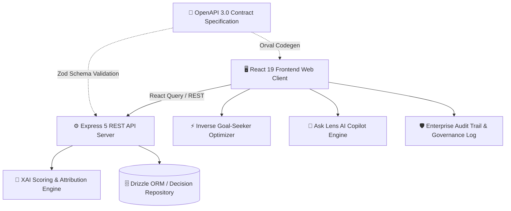

# 🔍 DecisionLens XAI — Explainable AI Decision-Support Platform

<div align="center">


**Turn complex operational uncertainty into defensible, mathematically grounded decisions.**

[Live Architecture](#-system-architecture) • [Core Innovations](#-key-features--innovations) • [XAI Mathematical Formulation](#-xai-scoring--attribution-mathematics) • [Local Setup](#-getting-started)

</div>

---

## 💡 What is DecisionLens XAI?

In modern enterprise environments, AI decision systems too often function as **opaque black boxes** — giving scores without transparency, leaving executive leadership unable to defend critical calls in boardrooms or audits.

**DecisionLens XAI** is an **Explainable AI (XAI) Decision-Support Platform** built specifically for high-consequence operational, technical, and strategic readiness evaluations. Rather than providing unverified probability outputs, DecisionLens decomposes decisions across **7 core business and technical pillars**, computes exact directional attribution (positive lift vs. penalty drag), estimates calibrated confidence intervals, and synthesizes plain-language executive rationale.

---

## 🚀 Key Features & Innovations

### 1. 🧠 Transparent 7-Factor XAI Scoring Engine
- Evaluates scenarios across **Strategic Alignment**, **Financial Readiness**, **Technical Readiness**, **Team Readiness**, **Market Evidence**, **Risk Exposure** (inverted), and **Timeline Pressure** (inverted).
- Generates 3 discrete action tiers:
  - 🟢 **`PROCEED`** (Score $\ge 75$) — Cleared for deployment.
  - 🟡 **`PROCEED WITH GUARDRAILS`** ($55 \le \text{Score} < 75$) — Specific operational mitigations required.
  - 🔴 **`REWORK BEFORE COMMITTING`** ($\text{Score} < 55$) — Structural deficiencies present.

### 2. ⚡ Inverse Counterfactual "Goal-Seeker" Optimizer
- User targets a desired confidence or score threshold (e.g., *Reach 85 / Proceed*).
- The algorithm calculates the **minimal Pareto-optimal factor improvements** required to cross the threshold, highlighting the highest-ROI operational leverage points.

### 3. 🤖 "Ask Lens AI" Interactive Copilot & Memo Synthesizer
- Built-in explainability chatbot that parses the active decision dossier.
- One-click synthesis of **C-Level Executive Briefing Memos**, **Drag Factor Decompositions**, and **Adverse Condition Stress-Testing**.

### 4. 🏛️ Enterprise Multi-Role Stakeholder Governance & Audit Sign-Off
- Cryptographic-style sign-off stamps for **Chief Risk Officer (CRO)**, **Principal Solutions Architect**, and **VP Finance (CFO)**.
- Digital consensus tracking with custom audit conditions and timestamped signature hashes.

### 5. 📊 Advanced Explainability Visualizations
- **7-Axis Operational Radar Profile**: Visualizes multi-dimensional balance against the ideal 75-point baseline.
- **Attribution Waterfall (SHAP-Inspired)**: Itemizes exact positive point contributions versus negative penalties.

### 6. 🎛️ Real-Time What-If Sensitivity Simulator
- Live multi-factor parameter adjustments with instant re-calculation of score, confidence, and recommendation changes.

### 7. 📄 Client-Side Automated PDF Dossier Export
- Generates clean, standalone **Executive Briefing PDFs** using `jsPDF` with itemized factor tables, rationale, and next steps for instant auto-download.

### 8. 🏭 6 Real-World Industry Presets
- 🏥 **Healthcare**: Clinical Trial LLM Diagnostic Copilot (FDA/HIPAA SaMD)
- 💳 **Fintech**: Core Banking Ledger Cloud Migration (<10ms SLA)
- 🛡️ **Cybersecurity**: Enterprise Zero-Trust Architecture Enforcement
- 🤖 **Autonomous AI**: Tier-1 Support Agent Fleet Rollout
- 🌐 **SaaS Expansion**: EU Sovereign Cloud & Data Residency
- 🚚 **Logistics**: Predictive Real-Time Supply Chain Fulfillment

---

## 📐 System Architecture



---

## 🧮 XAI Scoring & Attribution Mathematics

### 1. Weighted Operational Readiness ($S_{raw}$)
$$S_{raw} = \sum_{i=1}^{7} w_i \cdot \hat{x}_i$$

Where:
- $\hat{x}_i = x_i$ for positive factors (Strategic, Financial, Technical, Team, Market)
- $\hat{x}_i = 100 - x_i$ for penalty factors (Risk Exposure, Timeline Pressure)
- $\sum_{i=1}^{7} w_i = 1.00$

### 2. Factor Attribution ($\Delta_i$)
Each factor's directional impact against a neutral baseline ($B = 50$) is calculated as:
$$\Delta_i = w_i \cdot (\hat{x}_i - B)$$

### 3. Calibrated Confidence Metric ($C$)
Confidence is a function of factor alignment, variance penalty, and strategic signal strength:
$$C = \min\left(95, \max\left(50, 100 - 1.2 \cdot \sigma(\mathbf{x}) + 0.1 \cdot \text{StrategicAlignment}\right)\right)$$

---

## 💻 Getting Started

### Prerequisites
- Node.js $\ge 20.0$
- pnpm (`npx pnpm`)

### Installation & Launch

```bash
# 1. Install dependencies across workspace
npx pnpm install

# 2. Codegen API client types from OpenAPI spec
npx pnpm --filter @workspace/api-spec run codegen

# 3. Start Backend API Server (Port 5000)
npx pnpm --filter @workspace/api-server run dev

# 4. Start Frontend Web Client (Port 5173)
npx pnpm --filter @workspace/decisionlens-xai run dev
```

Visit **`http://localhost:5173`** in your browser.

---

## 🧪 Testing & Verification

```bash
# Run backend scoring unit tests
npx pnpm --filter @workspace/api-server test

# Run full project typechecks
npx pnpm run typecheck

# Build production bundle
npx pnpm --filter @workspace/decisionlens-xai run build
```

---

## 📜 License
Distributed under the MIT License. Developed for high-consequence enterprise decision intelligence.